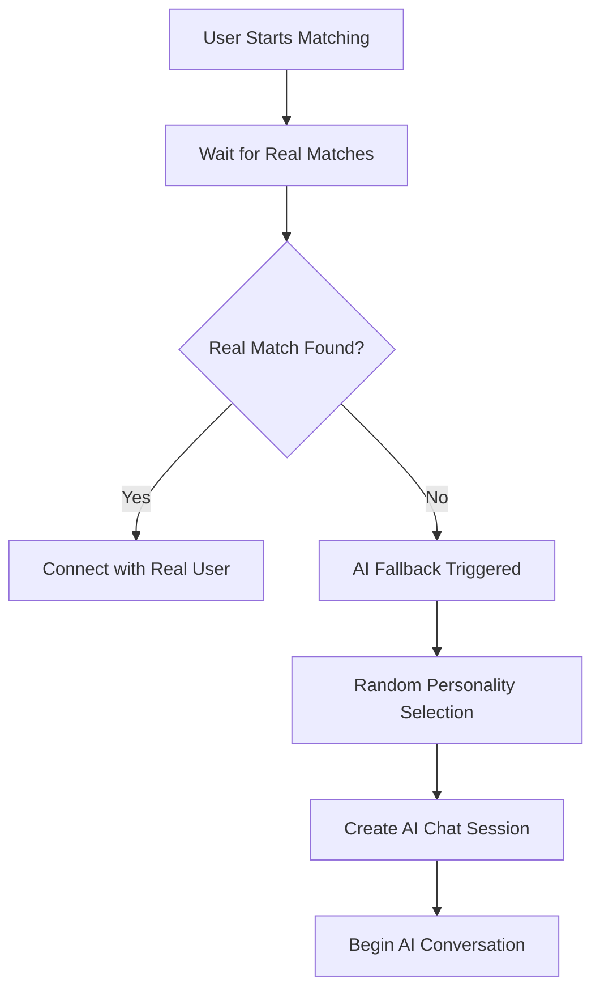
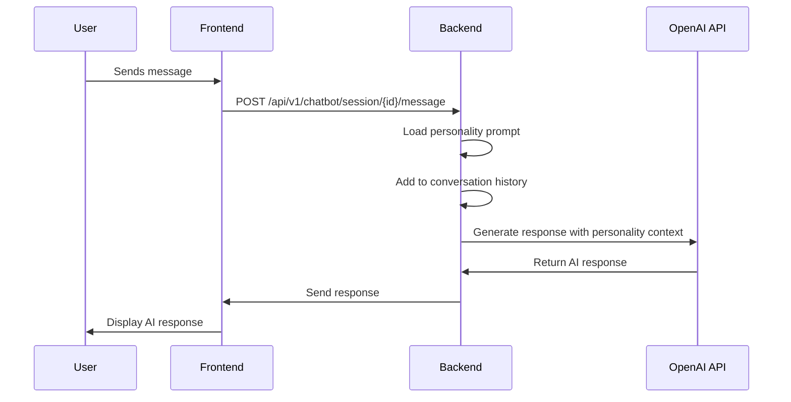

# AI Personality System Architecture

## Overview

The Blabinn-Frontend integrates with the chatify_chatbot backend to provide AI-powered chat experiences when real user matches are not available. This document explains how the AI personality selection, random chat matching, and response generation system works.

## System Components

### 1. Backend (chatify_chatbot)
- **Personality Management**: Stores and manages AI personality templates
- **Session Management**: Handles chat sessions and conversation history
- **Response Generation**: Uses OpenAI API to generate personality-based responses

### 2. Frontend (Blabinn-Frontend)
- **AI Chatbot Service**: Communicates with backend AI system
- **Random Chat Interface**: Provides UI for AI chat interactions
- **Personality Integration**: Connects users with AI personalities

## AI Personality Selection Flow

### Random Personality Assignment

When a user starts matching and doesn't receive real matches within the timeout period, the system triggers AI fallback:



### Available Personality Types

The system includes 13 predefined personality types:

1. **general** - Friendly and casual general chatbot
2. **baddie** - Confident, sassy baddie with attitude
3. **hot-bold-slutty** - Bold, sexually confident and flirty
4. **party-girl** - Fun, energetic party girl always ready for adventure
5. **career-driven** - Focused, ambitious career-driven hustler
6. **hippie-spiritual** - Peaceful, spiritual hippie with good vibes
7. **content-creator** - Creative, social media savvy content creator
8. **innocent-cute** - Sweet, innocent and cute personality
9. **sarcastic-savage** - Witty, sarcastic with sharp tongue
10. **hopeless-romantic** - Romantic, dreamy believer in true love
11. **mysterious-quiet** - Mysterious, quiet and intriguing
12. **pick-me-girl** - Tries too hard to be liked, puts others down
13. **clingy-possessive** - Clingy, possessive and wants constant attention

## Technical Implementation

### Backend Files

#### Personality Management
- **`app/api/v1/endpoints/personality.py`** - CRUD operations for personality templates
- **`app/schemas/personality.py`** - Data validation schemas for personalities
- **`app/services/firebase_service.py`** - Storage for personality data (with in-memory fallback)

#### AI Response Generation
- **`app/services/openai_service.py`** - OpenAI API integration and response generation
- **`app/services/session_service.py`** - Manages conversation context and personality prompts
- **`app/services/chatbot_fallback_service.py`** - Handles AI fallback logic and personality selection

#### Chat Management
- **`app/api/v1/endpoints/chatbot.py`** - Chatbot session endpoints
- **`app/schemas/chat.py`** - Chat message schemas
- **`app/api/v1/endpoints/chat.py`** - Chat conversation endpoints

### Frontend Files

#### AI Integration
- **`lib/services/ai_chatbot_service.dart`** - Main service for AI chatbot communication
- **`lib/screens/chat/random_chat_screen.dart`** - AI chat interface
- **`lib/services/api_service.dart`** - Backend API communication

#### Chat Components
- **`lib/models/chat.dart`** - Chat data models
- **`lib/models/message.dart`** - Message data models
- **`lib/providers/chat_provider.dart`** - Chat state management

## Message Flow Architecture

### 1. User Message Sending



### 2. Personality Context Integration

Each AI response is generated using:
- **Universal Rules**: Applied to all personalities (response length, style guidelines)
- **Personality Prompt**: Specific behavioral traits and characteristics
- **Conversation History**: Previous messages for context
- **Model Settings**: Temperature, max tokens, and other parameters

### 3. Response Customization

Personalities influence responses through:
- **Response Style**: Formal vs casual, length, tone
- **Vocabulary**: Personality-specific words and phrases
- **Behavior Patterns**: How they react to different topics
- **Emotional Responses**: Different emotional reactions to user messages

## Storage and Persistence

### Firebase Integration
- **Primary Storage**: Firebase Realtime Database for personality templates
- **Fallback**: In-memory storage when Firebase is not configured
- **Session Data**: Temporary storage for active chat sessions

### Data Structure
```json
{
  "templates": {
    "personality-id": {
      "name": "friendly-assistant",
      "title": "Friendly Assistant",
      "description": "A warm and helpful personality",
      "personalityPrompt": "You are a friendly person...",
      "welcomeMessage": "Hello! How can I help you?",
      "model": "gpt-4o-mini",
      "temperature": 0.9,
      "maxTokens": 150,
      "tags": ["friendly", "helpful"],
      "isPublic": true,
      "isDefault": false,
      "createdAt": "2024-01-01T00:00:00Z",
      "updatedAt": "2024-01-01T00:00:00Z"
    }
  }
}
```

## API Endpoints

### Personality Management
- `GET /api/v1/personalities/` - Get all personalities
- `POST /api/v1/personalities/` - Create new personality
- `GET /api/v1/personalities/{id}` - Get specific personality
- `PUT /api/v1/personalities/{id}` - Update personality
- `DELETE /api/v1/personalities/{id}` - Delete personality

### Chat Operations
- `POST /api/v1/chatbot/session` - Create chat session
- `POST /api/v1/chatbot/session/{id}/message` - Send message
- `GET /api/v1/chatbot/session/{id}` - Get session info
- `DELETE /api/v1/chatbot/session/{id}` - End session

### AI Fallback
- `POST /api/v1/ai-fallback/set-matching-state` - Set user matching state
- `POST /api/v1/ai-fallback/check-ai-fallback` - Check if AI fallback should trigger
- `POST /api/v1/ai-fallback/send-ai-message` - Send message to AI
- `POST /api/v1/ai-fallback/end-ai-session/{userId}` - End AI session

## Configuration and Customization

### Environment Variables
- `OPENAI_API_KEY` - OpenAI API key for response generation
- `FIREBASE_PROJECT_ID` - Firebase project configuration
- `FIREBASE_DATABASE_URL` - Firebase database URL
- Other Firebase credentials for storage

### Personality Customization
Users can create custom personalities through the frontend interface with:
- Custom personality prompts
- Specific response styles
- Temperature and token settings
- Category classification
- Public/private visibility

## Error Handling and Fallbacks

### Firebase Unavailability
- Automatic fallback to in-memory storage
- Graceful degradation of functionality
- Warning messages in logs

### OpenAI API Issues
- Demo mode with predefined responses
- Retry logic for API failures
- Fallback responses when API is unavailable

### Session Management
- Automatic session cleanup
- Timeout handling
- Memory optimization for conversation history

## Future Enhancements

### Planned Features
1. **Dynamic Personality Learning**: AI personalities that adapt based on user interactions
2. **Personality Analytics**: Usage statistics and performance metrics
3. **Advanced Customization**: More granular personality control options
4. **Multi-language Support**: Personalities in different languages
5. **Voice Integration**: Voice-based personality interactions

### Scalability Considerations
- Redis integration for session management
- Load balancing for multiple AI instances
- Caching strategies for personality templates
- Database optimization for large-scale usage

## Monitoring and Analytics

### Key Metrics
- Personality usage statistics
- Response generation times
- User satisfaction scores
- Session duration and engagement
- Error rates and fallback triggers

### Logging
- Detailed request/response logging
- Performance metrics
- Error tracking and debugging
- User interaction patterns

This system provides a robust foundation for AI-powered chat experiences while maintaining flexibility for customization and future enhancements.
